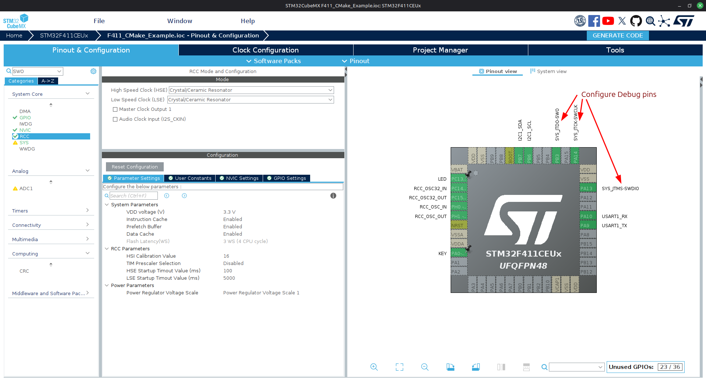
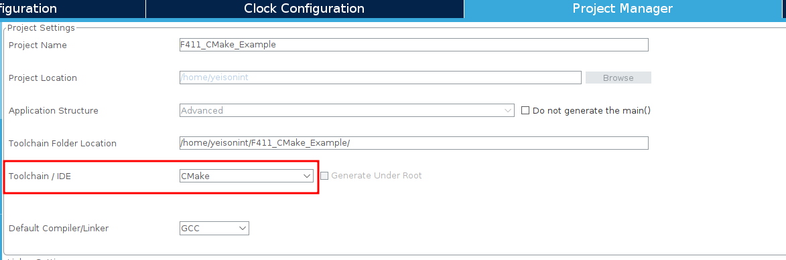

# F411 CMake Project Example
CMake project example that uses a custom toolchain and debuggin in VS code.

This repository must be use as project example for another SMT32 boards, you can create the project using [STM32CubeMX](https://www.st.com/en/development-tools/stm32cubemx.html) or [STM32CubeIDE](https://www.st.com/en/development-tools/stm32cubeide.html).

## Project creation (STM32CubeMX)

Open STM32CubeMX and select your chip or board, prepare all necessary configurations.

Go to `Project Manager` and select CMake in `Toolchain / IDE` option.

Now you can generate the code!