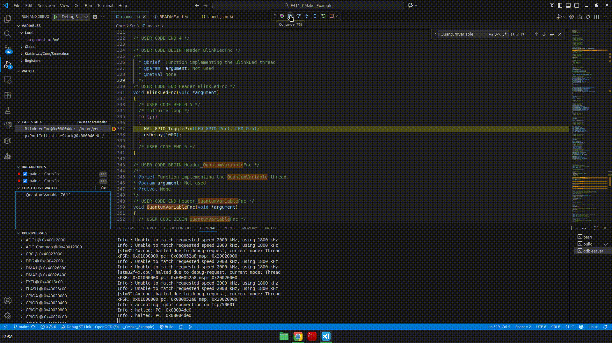

# F411 CMake Project Example
CMake project example that uses a custom toolchain and debuggin in VS code.

This repository must be use as project example for another SMT32 boards, you can create the project using [STM32CubeMX](https://www.st.com/en/development-tools/stm32cubemx.html) or [STM32CubeIDE](https://www.st.com/en/development-tools/stm32cubeide.html).

## Project creation (STM32CubeMX)

Open STM32CubeMX and select your chip or board, prepare all necessary configurations.


Go to `Project Manager` and select CMake in `Toolchain / IDE` option.


Now you can generate the code!

## Install tools

Install `stlink-tools` and `openocd` to flash and debug, you can also use [STM32CubeProg](https://www.st.com/en/development-tools/stm32cubeprog.html).

```bash
sudo apt install stlink-tools openocd
```

### Download toolchain 

Download the ARM toolchain (bare-metal target arm-none-eabi) from the [arm Developer](https://developer.arm.com/downloads/-/arm-gnu-toolchain-downloads) web page and copy the contents to the `toolchain` folder, or install in your system with:

```bash
sudo apt install gcc-arm-none-eabi gdb-multiarch
```

## Build Release and Debug

If you don't install the `arm-none-eabi` toolchain in your system, you will need to provide one and copy to `toolchain` folder and add to the `PATH` environment variable.

```bash
export PATH="$(pwd)/toolchain/bin:$PATH"
```

Now you can build the `Release` profile with:

```bash
rm -rf build/Release
cmake -S . -B build/Release \
  -DCMAKE_TOOLCHAIN_FILE="$(pwd)/cmake/gcc-arm-none-eabi.cmake" \
  -DCMAKE_BUILD_TYPE=Release
cmake --build build/Release -j
```

or the `Debug` profile:

```bash
rm -rf build/Debug
cmake -S . -B build/Debug \
  -DCMAKE_TOOLCHAIN_FILE="$(pwd)/cmake/gcc-arm-none-eabi.cmake" \
  -DCMAKE_BUILD_TYPE=Debug
cmake --build build/Debug -j
```

## Flash

The build process generate an `ELF` file, to upload using `st-flash` you need convert to `HEX` first, go to `build/Release` or `build/Debug` and run:

```bash
cd build/Debug # or build/Release
arm-none-eabi-objcopy -O binary F411_CMake_Example.elf F411_CMake_Example.bin
st-flash --reset write F411_CMake_Example.bin 0x08000000
```

## Debug

Install these extensions:

- [C/C++ Extension Pack](https://marketplace.visualstudio.com/items?itemName=ms-vscode.cpptools-extension-pack)
- [Cortex-Debug](https://marketplace.visualstudio.com/items?itemName=marus25.cortex-debug)


Copy the `.vscode` folder to your new project and modify according your MCU.

### Debug with OpenOCD

Go to `Run and Debug` or press `Ctrl+Shift+D` and run `Debug ST-Link + OpenOCD`.



If you want to add an external library (like SSD1306 display driver) add the include path and sources to the `CMakeLists.txt` file, this file does not regenerate with the `STM32CubeMX` tool.


